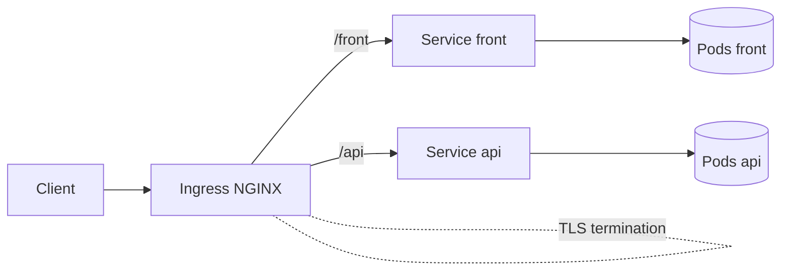

# S4 — Ingress, TLS, Config & Secrets (Workshop) — Windows / PowerShell Edition (Fixed)

**Cible : Windows + PowerShell (sans WSL)**  
**Correctif :** image `front` basculée sur Docker Hub (`nginxdemos/hello:plain-text`) pour éviter les erreurs GHCR 403.

## Prérequis
- **Docker Desktop for Windows** (service en marche)
- **k3d** (https://k3d.io/#installation)
- **kubectl** (https://kubernetes.io/docs/tasks/tools/)
- **PowerShell** (Admin recommandé pour modifier `hosts`)

> **Astuce exécution :**
> ```powershell
> Set-ExecutionPolicy -Scope Process Bypass
> ```

## Lancement rapide
```powershell
.\run.ps1
```
Le script `run.ps1` :
1) met la policy d'exécution pour la session,  
2) vérifie Docker/k3d/kubectl,  
3) exécute 01→04,  
4) propose d’ajouter `127.0.0.1 workshop.local` dans `hosts`.

## Tests
```powershell
curl -k https://workshop.local/front
curl -k https://workshop.local/api/get
```

## Scripts inclus
- `01-create-k3d-cluster.ps1` — crée le cluster k3d (ports 80/443 exposés)
- `02-install-ingress-nginx.ps1` — installe le contrôleur Ingress
- `03-install-cert-manager.ps1` — installe cert-manager
- `04-deploy-workshop.ps1` — applique les manifests + attend Ready
- `05-rollback_demo.ps1` — démo rollback
- `06-add-hosts-entry.ps1` — ajoute `127.0.0.1 workshop.local`
- `99-cleanup.ps1` — supprime le cluster
- `run.ps1` — orchestrateur pas-à-pas

## Diagramme L7 (Mermaid)



> **Note Ingress v4 :** Les chemins utilisent des regex et la réécriture (`/$2`) pour que `/front` serve `/` du front et `/api/*` soit réécrit vers l'API. Test : `curl -k https://workshop.local/front` et `curl -k https://workshop.local/api/get`.


> **Note Ingress v5 :** `pathType: ImplementationSpecific` + `ingressClassName: nginx` pour activer les regex et la réécriture NGINX.
